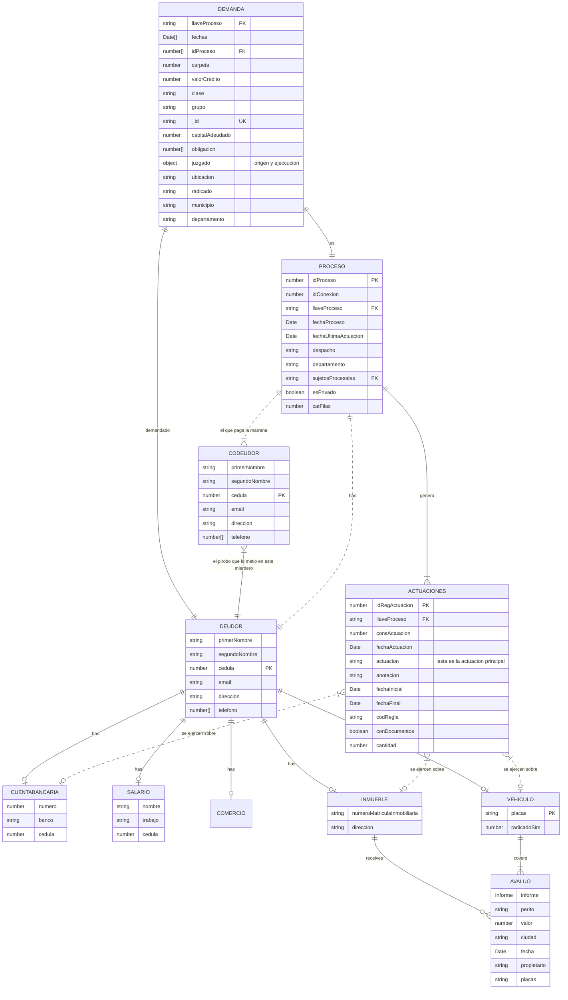
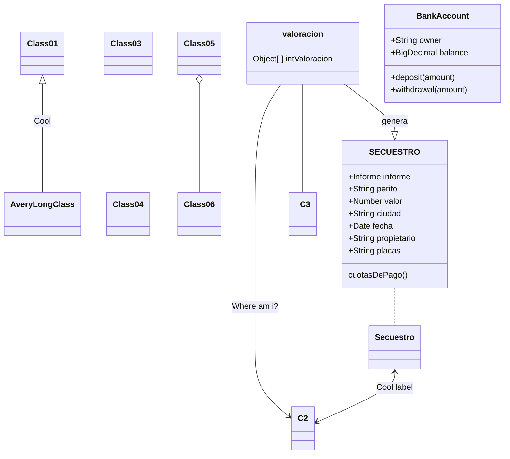

#Procesos

## EtapasProcesales

```mermaid
erDiagram
DEMANDA {
    string llaveProceso PK
    Date[] fechas
    number[] idProceso FK
    number carpeta
    number valorCredito
    string clase
    string grupo
    string _id UK
    number capitalAdeudado
    number[] obligacion
    object juzgado "origen y ejeccucion"
    string ubicacion
    string radicado
    string municipio
    string departamento
}
DEMANDA ||--|| PROCESO : es
PROCESO {
    number idProceso PK
    number idConexion
    string llaveProceso FK
    Date fechaProceso
    Date fechaUltimaActuacion
    string despacho
    string departamento
    string sujetosProcesales FK
    boolean esPrivado
    number catFilas
}
DEMANDA ||--|| DEUDOR : demandado
DEUDOR {
string primerNombre
string segundoNombre
number cedula PK
string email
string direccion
number[] telefono
}
CUENTABANCARIA {
    number numero
    string banco
    number cedula
}
SALARIO {
    string nombre
    string trabajo
    number cedula
}
DEUDOR ||--o| COMERCIO : has
DEUDOR ||--o| SALARIO : has
DEUDOR ||--o| VEHICULO : has
DEUDOR ||--o| INMUEBLE : has
DEUDOR ||--o| CUENTABANCARIA : has
CODEUDOR }|--|| DEUDOR : "el pirobo que lo metio en este mierdero"
PROCESO ||--|{ ACTUACIONES : genera
PROCESO ||..|{CODEUDOR :"el que paga la marrana"
PROCESO ||..|| DEUDOR : has
ACTUACIONES }|..o| VEHICULO : "se ejercen sobre"
ACTUACIONES }|..o| INMUEBLE : "se ejercen sobre"
ACTUACIONES }|..o| CUENTABANCARIA : "se ejercen sobre"
INMUEBLE ||--o{ AVALUO : receives
VEHICULO ||--|{ AVALUO : covers
VEHICULO{
    string placas PK
    number radicadoSim
}
INMUEBLE{
    string numeroMatriculaInmobiliaria
    string direccion

}

CODEUDOR {
string primerNombre
string segundoNombre
number cedula PK
string email
string direccion
number[] telefono
}
AVALUO {
Informe informe
string perito
number valor
string ciudad
Date fecha
string propietario
string placas
}
ACTUACIONES{
    number idRegActuacion PK
    string llaveProceso FK
    number consActuacion
    Date fechaActuacion
    string actuacion "esta es la actuacion principal"
    string anotacion
    Date fechaInicial
    Date fechaFinal
    string codRegla
    boolean conDocumentos
    number cantidad
}


```

## Classes

```mermaid
classDiagram
class SECUESTRO{
+Informe informe
+String perito
+Number valor
+String ciudad
+Date fecha
+String propietario
+String placas
}
Class01 <|-- AveryLongClass : Cool
Class03 _-- Class04
Class05 o-- Class06
SECUESTRO .. Secuestro
valoracion --> C2 : Where am i?
valoracion --_ C3
valoracion --|> SECUESTRO : genera
valoracion: Object[ ] intValoracion
SECUESTRO : cuotasDePago()
Secuestro <--> C2: Cool label
class BankAccount{
+String owner
+BigDecimal balance
+deposit(amount)
+withdrawal(amount)
}
```

##
